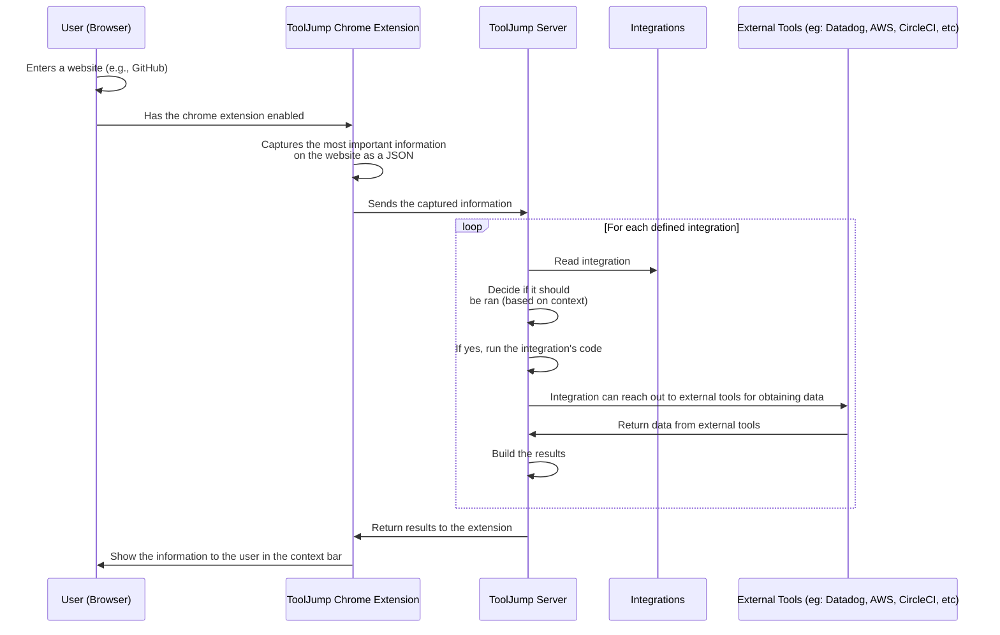

# ToolJump Architecture - How Connecting Tools Works

ToolJump's architecture enables powerful [connecting tools](/docs/connecting-your-tools-resources) capabilities through a [Knowledge as a Service](/docs/knowledge-as-a-service) approach that dramatically improves [developer experience](/docs/developer-experience). The system is comprised of 3 main components:

1. **ToolJump Chrome Extension** - Delivers contextual information directly in your workflow
2. **ToolJump Server** - Processes context and runs integrations for connecting tools
3. **ToolJump Integrations** - JavaScript modules that connect your specific tools

|                     | ToolJump Chrome Extension                    | ToolJump Server                    | ToolJump Integrations                    |
|--------------------------|---------------------------------------------|-----------------------------------|------------------------------------------|
| **What it does do?**   | Understands the pages you visit, sends the summary to the ToolJump server, and gets back useful insights and links to other tools | Based on the data received from extensions, runs the user-defined integrations and returns the results to the users  | Provides the logic for connecting tools between them |
| **Where is it Deployed?**   | In user's browser (client-side)               | Cloud / on‑prem server belonging to you/your company            | In a GitHub repo belonging to you/your company|
| **How to install/deploy it?**       | [Download the Chrome extension](/docs/getting-started) to your browser and point it to your ToolJump server (5 mins)                | You or your DevOps team [can set it up](/docs/deploying) in your company (1-5 days)           | Your senior engineers can [write the integrations](/docs/writing-integrations) based on the knowhow of available tools in your company (1-5 days)                  |

:::info
ToolJump is self-hosted. You can host it yourself, and you are responsible for its deployments, security, monitoring and storing the secrets for the tools that ToolJump communicates with. We do not store anything on our side.
:::

For detailed security considerations, see our [security documentation](/docs/security).

## End to end functionality

Here's the end to end flow, from a page visit all the way to getting the insights in the ToolJump context bar:

Learn how to build integrations in our [writing integrations guide](/docs/writing-integrations).
